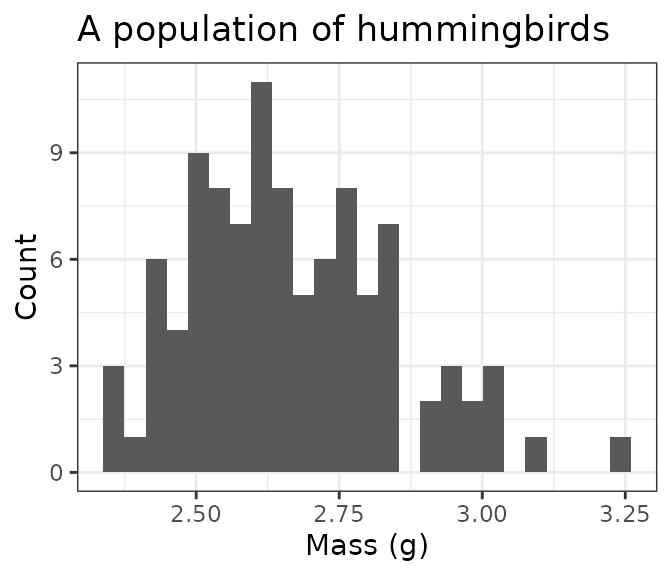
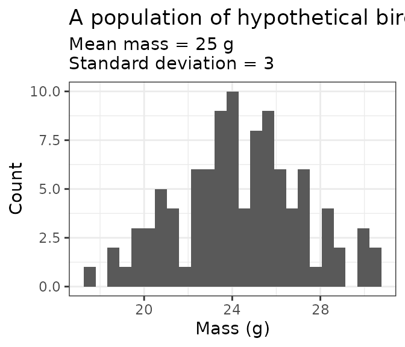
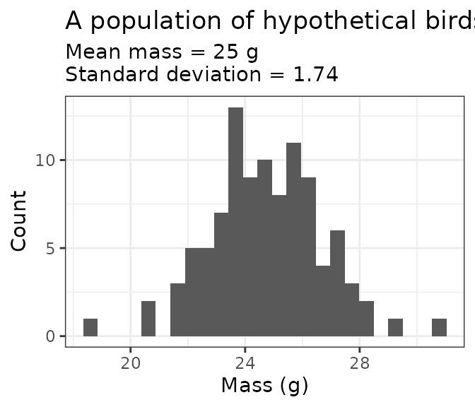
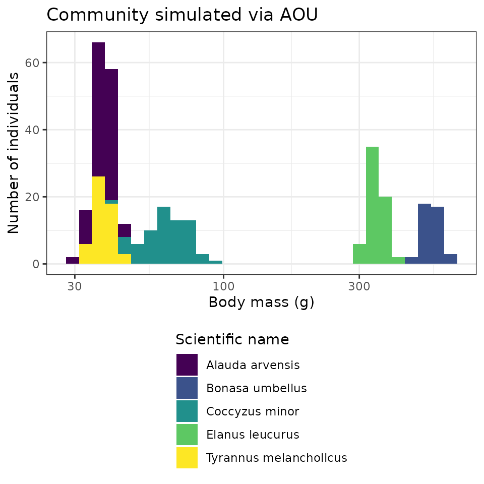
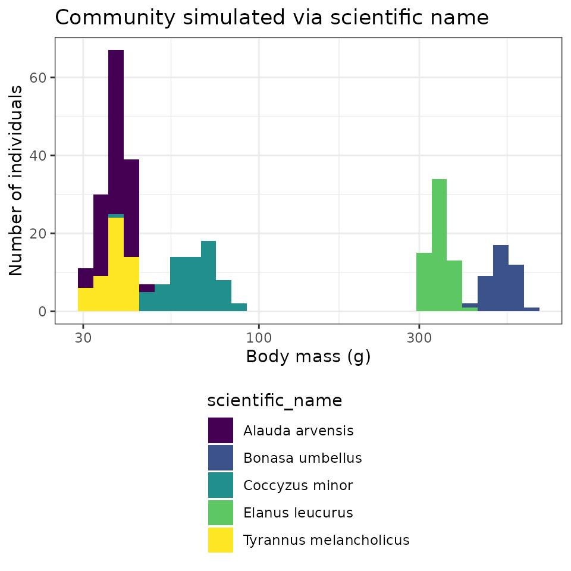
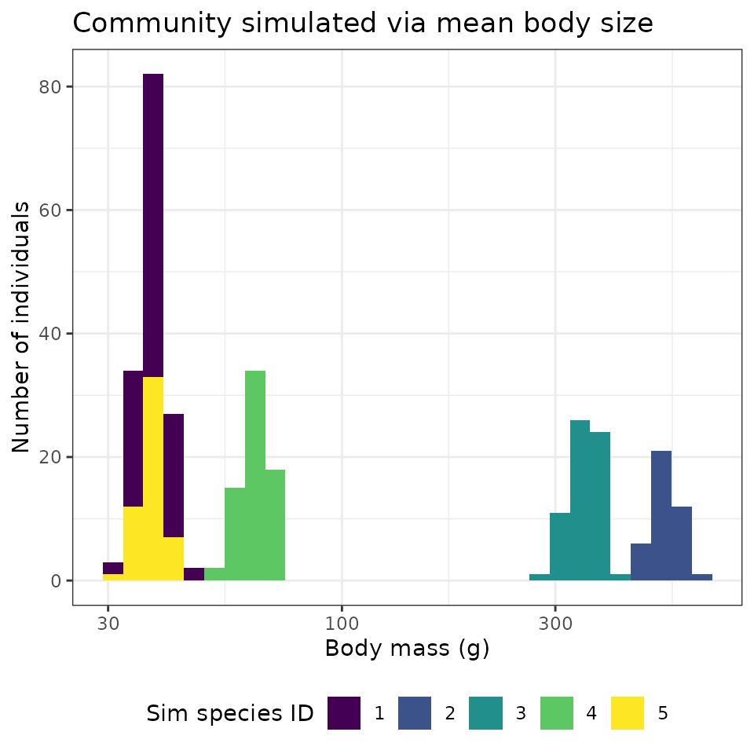

# birdsize

``` r

library(birdsize)
library(dplyr)
#> 
#> Attaching package: 'dplyr'
#> The following objects are masked from 'package:stats':
#> 
#>     filter, lag
#> The following objects are masked from 'package:base':
#> 
#>     intersect, setdiff, setequal, union
library(ggplot2)
theme_set(theme_bw())
```

## Overview

`birdsize` simulates mass measurements (in g) for birds. Working from
the assumption that individuals of a species have body masses normally
distributed around a species-wide mean and standard deviation,
`birdsize` simulates individual-level body mass measurements by drawing
from species-specific normal distributions. There are parameters
built-in for 450 bird species, or a user may supply mean and optionally
standard deviation values for additional species.

The core functions in `birdsize` apply at 3 levels of organization:
species, population, and community:

- The `species_*` functions take information about a real or
  hypothetical species and look up or calculate the parameters necessary
  to simulate body size distributions for that species.
- The `population_*` functions use species-level parameters and
  abundances (population sizes) to simulate individual body size and
  basal metabolic rate measurements to make up populations of that
  species.
- The `community_*` functions generate individual body mass estimates
  for multiple populations in one go (e.g. populations of different
  species, or populations of the same species at different points in
  time or different sampling locations).

## Species-level parameters

In order to generate body mass estimates for a species, `birdsize` needs
an *abundance value* (how many individuals to generate estimates for)
and at least one of:

- For one of the 450 species known to `birdsize`: the scientific name
  (as `"Genus species"`) or the [AOU numeric
  code](https://www.pwrc.usgs.gov/bbs/specieslist.html). See *LINK* for
  a list of the species with data included in `birdsize`.
- For any other species: the mean body mass (in g) for that species. If
  a standard deviation value is provided, it will be used. Otherwise, it
  will be estimated based on the mean body mass via the scaling
  relationship described in the scaling vignette.

The `species_define` function uses the information provided to look up,
or calculate, the mean and standard deviation of body mass to use to
generate individuals of the desired species. This function usually
operates under the hood, but may be of interest to advanced users or
those interested in complex simulations involving changes to the
species-wide parameters.

## Population (one species) simulations

### Using species identity

For the birds known to `birdsize` you can use the species’ code (AOU) to
simulate a population directly. For the hummingbird *Selasphorus
calliope*:

``` r

a_hundred_hummingbirds <- pop_generate(abundance = 100, AOU = 4360)

head(a_hundred_hummingbirds)
#>    AOU sim_species_id individual_mass individual_bmr mean_size   sd_size
#> 1 4360           4360        2.556873       20.50623      2.65 0.1818394
#> 2 4360           4360        3.101904       23.53533      2.65 0.1818394
#> 3 4360           4360        2.833263       22.06327      2.65 0.1818394
#> 4 4360           4360        2.703245       21.33652      2.65 0.1818394
#> 5 4360           4360        2.612003       20.82052      2.65 0.1818394
#> 6 4360           4360        2.987874       22.91515      2.65 0.1818394
#>   abundance  sd_method      scientific_name
#> 1       100 AOU lookup Selasphorus calliope
#> 2       100 AOU lookup Selasphorus calliope
#> 3       100 AOU lookup Selasphorus calliope
#> 4       100 AOU lookup Selasphorus calliope
#> 5       100 AOU lookup Selasphorus calliope
#> 6       100 AOU lookup Selasphorus calliope

ggplot(a_hundred_hummingbirds, aes(individual_mass)) +
  geom_histogram(bins = 25) +
  xlab("Mass (g)") +
  ylab("Count") +
  ggtitle("A population of hummingbirds")
```



### Using a known mean and standard deviation

Alternatively, you can simulate body masses for a population by
supplying the body size parameters yourself. This may be useful if you
would like to work with a species not included in `birdsize`, test
sensitivities to different parameter ranges, or generate values for
simulation/null models (or, other applications!).

**Note that, if both mean mass and a species code are provided, the
species code will be used and the mean mass provided will be ignored!**

``` r

a_hundred_hypotheticals <- pop_generate(abundance = 100, mean_size = 25, sd_size = 3)

head(a_hundred_hypotheticals)
#>   AOU sim_species_id individual_mass individual_bmr mean_size sd_size abundance
#> 1  NA              1        19.86281       88.44888        25       3       100
#> 2  NA              1        22.60234       96.98414        25       3       100
#> 3  NA              1        20.76744       91.30263        25       3       100
#> 4  NA              1        26.59827      108.92055        25       3       100
#> 5  NA              1        23.80690      100.64180        25       3       100
#> 6  NA              1        24.14694      101.66465        25       3       100
#>              sd_method scientific_name
#> 1 Mean and SD provided            <NA>
#> 2 Mean and SD provided            <NA>
#> 3 Mean and SD provided            <NA>
#> 4 Mean and SD provided            <NA>
#> 5 Mean and SD provided            <NA>
#> 6 Mean and SD provided            <NA>

ggplot(a_hundred_hypotheticals, aes(individual_mass)) +
  geom_histogram(bins = 25) +
  xlab("Mass (g)") +
  ylab("Count") +
  ggtitle("A population of hypothetical birds", subtitle = "Mean mass = 25 g\nStandard deviation = 3")
```



### Using a known mean, but no standard deviation

If the mean mass is not known or not provided, `pop_generate` will
estimate the standard deviation based on scaling between the mean and
standard deviation of body mass:

``` r

another_hundred_hypotheticals <- pop_generate(abundance = 100, mean_size = 25)

head(another_hundred_hypotheticals)
#>   AOU sim_species_id individual_mass individual_bmr mean_size  sd_size
#> 1  NA              1        26.24416      107.88463        25 1.746196
#> 2  NA              1        21.44791       93.42580        25 1.746196
#> 3  NA              1        20.79538       91.39020        25 1.746196
#> 4  NA              1        23.75958      100.49914        25 1.746196
#> 5  NA              1        22.17191       95.66364        25 1.746196
#> 6  NA              1        22.58620       96.93474        25 1.746196
#>   abundance              sd_method scientific_name
#> 1       100 SD estimated from mean            <NA>
#> 2       100 SD estimated from mean            <NA>
#> 3       100 SD estimated from mean            <NA>
#> 4       100 SD estimated from mean            <NA>
#> 5       100 SD estimated from mean            <NA>
#> 6       100 SD estimated from mean            <NA>

ggplot(another_hundred_hypotheticals, aes(individual_mass)) +
  geom_histogram(bins = 25) +
  xlab("Mass (g)") +
  ylab("Count") +
  ggtitle("A population of hypothetical birds", subtitle = "Mean mass = 25 g\nStandard deviation = 1.74")
```



## Community (multiple populations) simulations

`community_generate` takes a dataframe with species-level information
(AOU, scientific name, or mean and/or standard deviation body mass) and
population sizes, and returns a dataframe of individual-level mass and
BMR measurements for all the entries in the input data frame.

### Simulations using AOU

Here, we use a synthetic dataset with records of `AOU` and `abundance`
for 5 species, to make up a community:

``` r

data("toy_aou_community")

head(toy_aou_community)
#> # A tibble: 5 × 2
#>     AOU abundance
#>   <dbl>     <dbl>
#> 1  4730        95
#> 2  3000        40
#> 3  3280        63
#> 4  3860        69
#> 5  4460        53
```

`community_generate` can take this table and generate simulated
individual measurements with no additional tweaks. It uses the `AOU` and
`abundance` columns from `toy_aou_community` to look up species’ mean
and standard deviation body masses based on their AOU and then draw
individual size measurements from a normal distribution with those
parameters.

``` r

toy_aou_sims <- community_generate(community_data_table = toy_aou_community, abundance_column_name = "abundance")

head(toy_aou_sims)
#>    AOU sim_species_id individual_mass individual_bmr mean_size  sd_size
#> 1 4730           4730        38.82847       142.6440    37.475 3.300613
#> 2 4730           4730        40.41270       146.7697    37.475 3.300613
#> 3 4730           4730        42.74367       152.7569    37.475 3.300613
#> 4 4730           4730        34.45230       130.9863    37.475 3.300613
#> 5 4730           4730        36.21842       135.7394    37.475 3.300613
#> 6 4730           4730        42.32158       151.6799    37.475 3.300613
#>   abundance  sd_method scientific_name
#> 1        95 AOU lookup Alauda arvensis
#> 2        95 AOU lookup Alauda arvensis
#> 3        95 AOU lookup Alauda arvensis
#> 4        95 AOU lookup Alauda arvensis
#> 5        95 AOU lookup Alauda arvensis
#> 6        95 AOU lookup Alauda arvensis
```

The resulting table has one row per individual, with a unique
`individual_size` and `individual_bmr` estimate for that individual.

We can then plot the individual size distribution for the community,
colored by species ID:

``` r


toy_aou_sims$`Scientific name` = toy_aou_sims$scientific_name

ggplot(toy_aou_sims, aes(individual_mass, fill = `Scientific name`)) +
  geom_histogram(position = "stack") +
  scale_fill_viridis_d() +
  scale_x_log10() +
  ggtitle("Community simulated via AOU") +
  xlab("Body mass (g)") +
  ylab("Number of individuals") +
  theme(legend.position = "bottom", legend.direction = "vertical")
#> `stat_bin()` using `bins = 30`. Pick better value `binwidth`.
```



### Simulation given species’ names

If the AOU is not known or not provided, `community_generate` will
attempt to look up species’ size parameters based on their scientific
name.

``` r

data("toy_species_name_community")

head(toy_species_name_community)
#> # A tibble: 5 × 2
#>   scientific_name        abundance
#>   <chr>                      <dbl>
#> 1 Alauda arvensis               95
#> 2 Bonasa umbellus               40
#> 3 Elanus leucurus               63
#> 4 Coccyzus minor                69
#> 5 Tyrannus melancholicus        53
```

`community_generate` still runs, but note that the `sd_method` here is
listed as `Scientific name lookup` rather than `AOU lookup` (above).

``` r

toy_species_name_sims <- community_generate(toy_species_name_community, abundance_column_name = "abundance")

head(toy_species_name_sims)
#>    AOU sim_species_id individual_mass individual_bmr mean_size  sd_size
#> 1 4730           4730        39.97640       145.6382    37.475 3.300613
#> 2 4730           4730        38.37580       141.4563    37.475 3.300613
#> 3 4730           4730        37.62253       139.4709    37.475 3.300613
#> 4 4730           4730        39.98764       145.6674    37.475 3.300613
#> 5 4730           4730        38.66003       142.2025    37.475 3.300613
#> 6 4730           4730        37.95838       140.3575    37.475 3.300613
#>   abundance              sd_method scientific_name
#> 1        95 Scientific name lookup Alauda arvensis
#> 2        95 Scientific name lookup Alauda arvensis
#> 3        95 Scientific name lookup Alauda arvensis
#> 4        95 Scientific name lookup Alauda arvensis
#> 5        95 Scientific name lookup Alauda arvensis
#> 6        95 Scientific name lookup Alauda arvensis
```

``` r

toy_species_name_sims$`Scientific name` = toy_species_name_sims$scientific_name

ggplot(toy_species_name_sims, aes(individual_mass, fill = scientific_name)) +
  geom_histogram(position = "stack") +
  scale_fill_viridis_d() +
  scale_x_log10() +
  ggtitle("Community simulated via scientific name") +
  xlab("Body mass (g)") +
  ylab("Number of individuals") +
  theme(legend.position = "bottom", legend.direction = "vertical")
#> `stat_bin()` using `bins = 30`. Pick better value `binwidth`.
```



### Simulation given mean size measurements

If species name or AOU are not known, or are not included in this
dataset (see `known_species` for the full set of included species),
estimates can still be generated by providing the mean and, if
available, standard deviation of body mass directly. If standard
deviation is provided, it will be used; if not, it will be estimated
based on the scaling relationship between mean and standard deviation of
body mass for birds (see the `scaling` vignette).

This functionality may be especially useful for users interested in
using their own parameter values, rather than relying on the ones
provided in `birdsize`. For example, `birdsize` does not take into
account temporal or geographic variation in body size, which may be
significant. A user could manually provide values to explore these
scenarios.

Note that 1) the mean body size data must be provided in a column named
`mean_size` and 2) the `sim_species_id` column acts as a species
identifier in the absence of other taxonomic information:

``` r

data(toy_size_community)

head(toy_size_community)
#> # A tibble: 5 × 3
#>   abundance mean_size sim_species_id
#>       <dbl>     <dbl>          <int>
#> 1        95      37.5              1
#> 2        40     532                2
#> 3        63     346                3
#> 4        69      63.9              4
#> 5        53      37.4              5
```

``` r

toy_size_sims <- community_generate(toy_size_community, abundance_column_name = "abundance")

head(toy_size_sims)
#>   AOU sim_species_id individual_mass individual_bmr mean_size  sd_size
#> 1  NA              1        39.74559       145.0382    37.475 2.625949
#> 2  NA              1        38.47302       141.7117    37.475 2.625949
#> 3  NA              1        35.73167       134.4362    37.475 2.625949
#> 4  NA              1        41.46384       149.4816    37.475 2.625949
#> 5  NA              1        38.36155       141.4188    37.475 2.625949
#> 6  NA              1        37.59558       139.3997    37.475 2.625949
#>   abundance              sd_method scientific_name
#> 1        95 SD estimated from mean            <NA>
#> 2        95 SD estimated from mean            <NA>
#> 3        95 SD estimated from mean            <NA>
#> 4        95 SD estimated from mean            <NA>
#> 5        95 SD estimated from mean            <NA>
#> 6        95 SD estimated from mean            <NA>
```

``` r

toy_size_sims$`Sim species ID` <- as.character(toy_size_sims$sim_species_id)

ggplot(toy_size_sims, aes(individual_mass, fill = `Sim species ID`)) +
  geom_histogram(position = "stack") +
  scale_fill_viridis_d() +
  scale_x_log10() +
  ggtitle("Community simulated via mean body size") +
  xlab("Body mass (g)") +
  ylab("Number of individuals") +
  theme(legend.position = "bottom")
#> `stat_bin()` using `bins = 30`. Pick better value `binwidth`.
```



### Community-wide summary statistics

The body size measurements generated by `birdsize` are estimates and are
generally best-suited for large-scale, aggregate analyses. For these
bigger-picture analyses, use general aggregation and summary functions
to generate community-wide summaries.

For example, using `dplyr`:

#### Biomass total by species

``` r

toy_species_name_sims_summary <-
  toy_species_name_sims |>
  group_by(scientific_name) |>
  summarize(
    total_mass = sum(individual_mass),
    total_n_individuals = n()
  )

toy_species_name_sims_summary
#> # A tibble: 5 × 3
#>   scientific_name        total_mass total_n_individuals
#>   <chr>                       <dbl>               <int>
#> 1 Alauda arvensis             3566.                  95
#> 2 Bonasa umbellus            21273.                  40
#> 3 Coccyzus minor              4409.                  69
#> 4 Elanus leucurus            21765.                  63
#> 5 Tyrannus melancholicus      1980.                  53
```

#### Community total biomass

``` r

toy_species_name_sims_totals <-
  toy_species_name_sims |>
  summarize(
    total_mass = sum(individual_mass),
    total_n_individuals = n(),
    total_species_richness = length(unique(scientific_name))
  )

toy_species_name_sims_totals
#>   total_mass total_n_individuals total_species_richness
#> 1   52992.77                 320                      5
```
