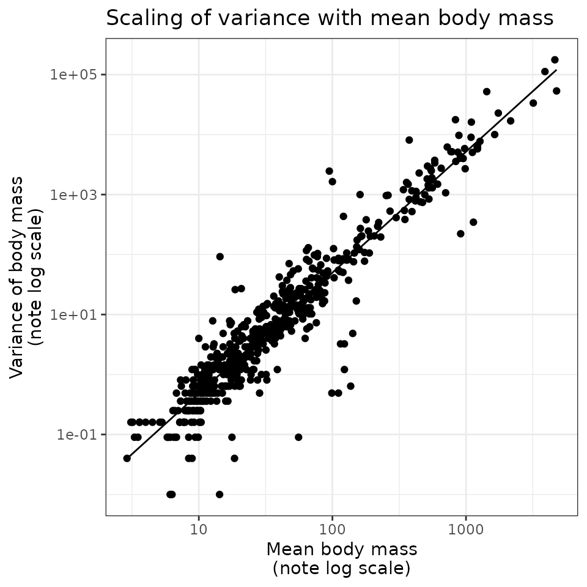
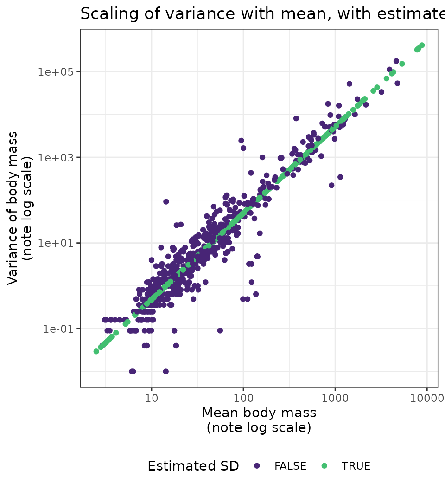

# scaling

The CRC Handbook of Avian Body Masses (Dunning 2008) contains records of
the mean and, for many species, the standard deviation of body mass for
bird species. However, there are many records in the CRC Handbook that
report mean body mass but no standard deviation, and it may also be
desirable to estimate size distributions for species not included in
this dataset (or even hypothetical species in a simulation or null
model) based only on a mean body size. For birds in the Breeding Bird
Survey, there is a strong scaling relationship between the mean and the
standard deviation of body mass (Thibault et al. 2011). This package
uses this scaling relationship to estimate the standard deviation of
body mass from the mean. This vignette illustrates the scaling
relationship and how it is used in the package.

``` r

library(birdsize)
library(dplyr)
library(ggplot2)
theme_set(theme_bw())
```

The `raw_masses` dataset (included in `bbssize`) includes all records
from the CRC Handbook (Dunning 2008) available for species in this
subset of the Breeding Bird Survey.

``` r

data(raw_masses)
```

Of the 928 records in `raw_masses`, 353 are missing the standard
deviation (affecting 204 species).

``` r

sp_for_sd <- dplyr::filter(
  raw_masses,
  !is.na(sd)
) |>
  dplyr::mutate(
    mass = as.numeric(mass),
    sd = as.numeric(sd)
  ) |>
  dplyr::mutate(var = sd^2) |>
  dplyr::mutate(
    log_m = log(mass),
    log_var = log(var)
  )

sd_fit <- stats::lm(sp_for_sd, formula = log_var ~ log_m)

sd_fit_summary <- summary(sd_fit)

sp_for_sd <- sp_for_sd |>
  mutate(est_sd = predict(sd_fit))
```

For records *with* reports of standard deviation, there is a close
scaling relationship between mean and variance of body mass. A linear
model of the form `log(variance(body_mass)) ~ log(mean(body_mass))` has
a model R2 of 0.89.

``` r

ggplot(sp_for_sd, aes(exp(log_m), exp(log_var))) +
  geom_point() +
  geom_line(aes(y = exp(est_sd))) +
  scale_x_log10() +
  scale_y_log10() +
  ggtitle("Scaling of variance with mean body mass") +
  xlab("Mean body mass\n(note log scale)") +
  ylab("Variance of body mass\n(note log scale)")
```



The model parameters are:

``` r

coefficients(sd_fit)
#> (Intercept)       log_m 
#>   -5.373838    2.015833
```

Which translate into a scaling relationship of:

$`var(m) = 0.0047\bar{m}^{2.01}`$

We use this scaling relationship to estimate the standard deviations for
records that have mass, but no reported standard deviation (353
records), shown in green in this plot:

``` r

raw_masses_with_estimated_sd <- raw_masses |>
  birdsize:::clean_sp_size_data() |>
  birdsize:::add_estimated_sds(sd_pars = birdsize:::get_sd_parameters(raw_masses)) |>
  dplyr::mutate(
    log_mass = log(mass),
    var = sd^2
  ) |>
  dplyr::mutate(
    log_var = log(var),
    `Estimated SD` = estimated_sd
  )

ggplot(raw_masses_with_estimated_sd, aes(exp(log_mass), exp(log_var), color = `Estimated SD`)) +
  geom_point() +
  scale_color_viridis_d(option = "viridis", begin = .1, end = .7) +
  ggtitle("Scaling of variance with mean, with estimates included") +
  xlab("Mean body mass\n(note log scale)") +
  ylab("Variance of body mass\n(note log scale)") +
  scale_x_log10() +
  scale_y_log10() +
  theme(legend.position = "bottom")
```



The internal function `birdsize:::species_estimate_sd` can be used to
estimate the standard deviation of body mass from the mean. This
function is called within `species_define` to add estimated standard
deviations to records of species that have body mass but no sd
measurements.

``` r

# Using species_estimate:
birdsize:::species_estimate_sd(sp_mean = 100)
#> [1] 7.061862


# Calculated manually - note slight numeric discrepancy due to truncating parameters:
sqrt(0.0047 * 100^2.01)
#> [1] 7.015343
```

See also Thibault et al. (2011) for this scaling relationship for a
slightly different subset of the Breeding Bird Survey.

## References

Dunning, J. B. (2008). CRC handbook of avian body masses (2nd ed.). CRC
Press.

Thibault, K. M., White, E. P., Hurlbert, A. H., & Ernest, S. K. M.
(2011). Multimodality in the individual size distributions of bird
communities. Global Ecology and Biogeography, 20(1), 145–153.
<https://doi.org/10.1111/j.1466-8238.2010.00576.x>
